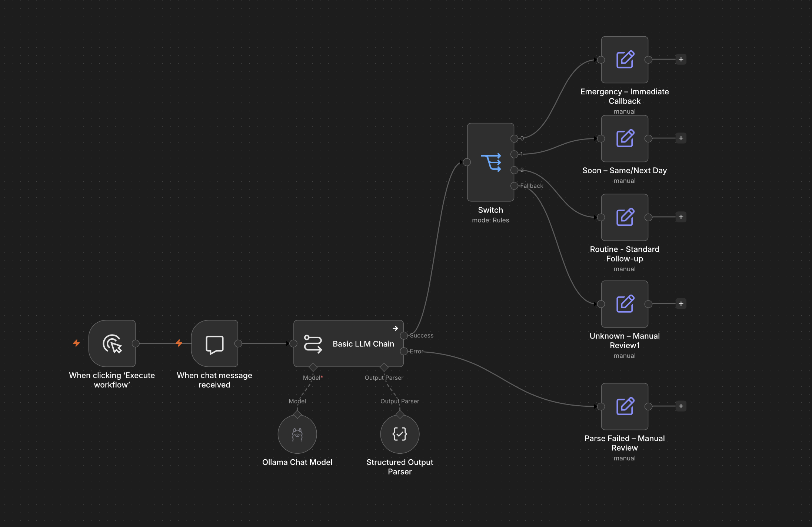

# HVAC Missed-Call Triage — Local AI Automation

An n8n workflow that reads transcripts of missed calls / voicemails for an HVAC
business, classifies how urgent each one is, and routes it to the right action —
running entirely on a **local LLM** with no paid API and no data leaving the
machine.

Built and tested on a 2019 Intel MacBook Pro (32 GB RAM) using only free,
self-hosted tooling.



---

## The problem

For a home-services business, a missed call is lost revenue. A customer with no
AC in 99° heat will simply call the next company. But not every missed call is an
emergency — some are quote requests that can wait two days. Manually listening to
and triaging voicemails is slow and inconsistent.

This workflow does the triage automatically: it reads the transcript, decides the
urgency, and produces a structured "ticket" with a recommended action, so the
emergencies get called back first and nothing slips through the cracks.

---

## What it does

```
Voicemail transcript
        │
        ▼
  LLM classifier  ──►  Structured JSON  ──►  Switch (route by urgency)
 (llama3.2:3b)         {name, phone,             │
                        issue, urgency,          ├─ emergency → Immediate callback (priority 1)
                        summary}                 ├─ soon      → Same/next day  (priority 2)
                                                 ├─ routine   → Standard queue (priority 3)
                                                 ├─ fallback  → Manual review  (priority 1)
                                                 └─ parse fail→ Manual review  (priority 1)
```

Each call exits the workflow as a complete ticket containing the customer's name,
phone, the issue, an urgency level, and a concrete next action.

### Urgency levels

| Level | Definition |
|-------|------------|
| `emergency` | No cooling in extreme heat / no heat in cold, any safety hazard (gas smell, smoke, electrical), or vulnerable people at risk. Immediate callback. |
| `soon` | System working but degraded (weak airflow, odd noise, partial cooling). Service within 24–48h. |
| `routine` | Maintenance, tune-ups, quotes, general questions. Standard follow-up. |

---

## Tech stack

- **n8n** (self-hosted via Docker) — workflow orchestration
- **Ollama** — local LLM runtime
- **llama3.2:3b** — the classification model (small enough to run on an Intel CPU)
- 100% local, $0 in API costs, no customer data sent to any third party

---

## Running it

**Prerequisites:** Docker Desktop and [Ollama](https://ollama.com) installed, with
the model pulled:

```bash
ollama pull llama3.2:3b
```

**Start n8n:**

```bash
docker compose up -d
```

Then open http://localhost:5678, import `workflow.json`, and in the **Ollama Chat
Model** node set the Base URL to:

```
http://host.docker.internal:11434
```

(n8n runs inside Docker, so it reaches Ollama on the host via
`host.docker.internal`, not `localhost`.)

Open the chat panel and paste a voicemail transcript to test.

---

## Engineering notes — the interesting part

The headline lesson of this project: **a 3B model running locally is not reliable
out of the box.** Getting it production-shaped meant treating the model as an
unreliable component and engineering the *system* around its weaknesses rather than
expecting the model to be perfect. The fixes below are each a response to a real
failure I hit during testing.

### 1. Reliability comes from the system, not the model
The model fails in three distinct ways: wrong classification, wrong output format,
and inventing values outside the allowed set. I addressed each:

- **Format wrapping** (model returned ```` ```json ```` fences + chatty notes):
  added an explicit "return only raw JSON, no markdown, no commentary" instruction.
- **Invented categories** (model returned `"Low"` instead of an allowed value):
  constrained the vocabulary in the prompt to exactly `emergency / soon / routine`.
- **Schema confusion**: defining the parser with a full manual JSON Schema actually
  made things *worse* — the small model echoed the schema structure back into its
  answer. Reverting to a simple JSON *example* fixed it. (Counter-intuitive, and a
  good reminder that more constraint isn't always better with small models.)
- **Non-determinism**: the same prompt parsed cleanly on some calls and failed on
  others. Lowering the sampling temperature to `0.1` meaningfully reduced format
  failures.

### 2. Fail safe, consistently
The system is designed so that when it's wrong, it's wrong in the *safe* direction:

- A **tiebreaker rule** tells the model to round *up* when unsure between two
  urgency levels. A routine call mistakenly flagged urgent costs a few wasted
  minutes; a real emergency mistakenly flagged routine could cost a customer or
  worse. The error budget is asymmetric, so the system reflects that.
- **Unknown** urgency values (fallback path) and **parse failures** (error path)
  are both escalated to human review at priority 1 — when the system isn't sure
  what it's looking at, it asks a human rather than silently filing it away.

### 3. Errors are handled, not hoped away
The LLM node's `On Error` is set to **Continue (using error output)**, so a
malformed model response doesn't crash the run — it flows down a dedicated
**Parse Failed → Manual Review** path. Every possible outcome, including failure,
has a defined destination.

---

## Test results

Tested at temperature `0.1` with llama3.2:3b. These are honest results — including
the misses, because the misses are the point.

| Test call | Expected | Result | Notes |
|-----------|----------|--------|-------|
| Elderly customer, no heat, 28° overnight | emergency | ✅ emergency | |
| Rattling noise, weak airflow, still running | soon | ✅ soon | Correctly distinguished "degraded" from "failed" |
| Gas smell, but caller says "no rush, probably nothing" | emergency | ✅ emergency | Correctly overrode the caller's calm tone |
| Minor issue mentioned first, buried real emergency | emergency | ✅ emergency | Classified on the worst issue, ignored the decoy |
| Quote request, "no rush at all" | routine | ✅ routine | |
| Dramatic ("DISASTER!!"), but only a thermostat app issue | routine | ❌ emergency | **Accepted miss** — tiebreaker bias over-flagged. Safe direction for HVAC; kept intentionally. |
| Voicemail with no phone number given | (n/a) | ✅ no hallucination | Did not invent a phone number; left it empty |

**Honest accuracy:** roughly 80% on classification, with the failures landing in the
safe direction by design. For a triage system that pre-sorts a human's callback
queue, that's a useful tool; it is intentionally *not* positioned as a fully
autonomous decision-maker.

---

## Known limitations

- A 3B model occasionally drops the least-important field (e.g. `summary`) to save
  tokens. Harmless for routing.
- Format failures still occur on a minority of calls; the error path catches them.
- "Dramatic-but-trivial" calls can be over-prioritized (see Diane in the table).
  This is a deliberate trade, not a bug.

## Possible next steps

- Swap the model to a larger one (or a cloud API) for the classification step where
  accuracy matters more than cost — the workflow is model-agnostic, so it's a
  one-field change.
- Replace the manual chat trigger with a real intake (voicemail-to-text webhook,
  email, or form).
- Add a retry-on-parse-failure loop before escalating to human review.
- Persist tickets to a database or Google Sheet for tracking.
